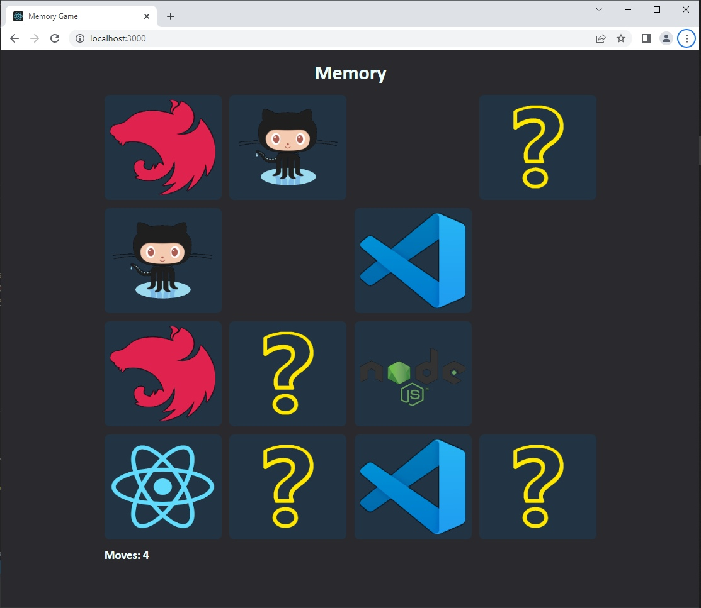

# React Memory Game

Simple memory game based on the React lib. Find pairs of cards to win the game. Good luck! 👍

Run game via Github Pages: [https://beskider.github.io/react-memory-game](https://beskider.github.io/react-memory-game)



## Technologies

* [React](https://pl.reactjs.org/)
* [Create React App](https://github.com/facebook/create-react-app)
* HTML, CSS, JS 

## Running

```
	$ ./npm start
```
